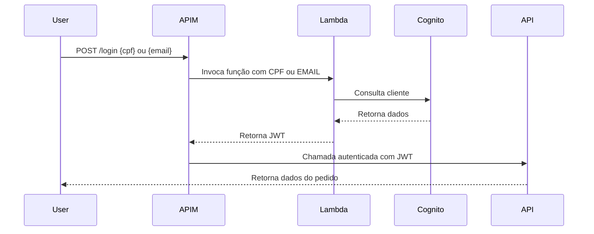
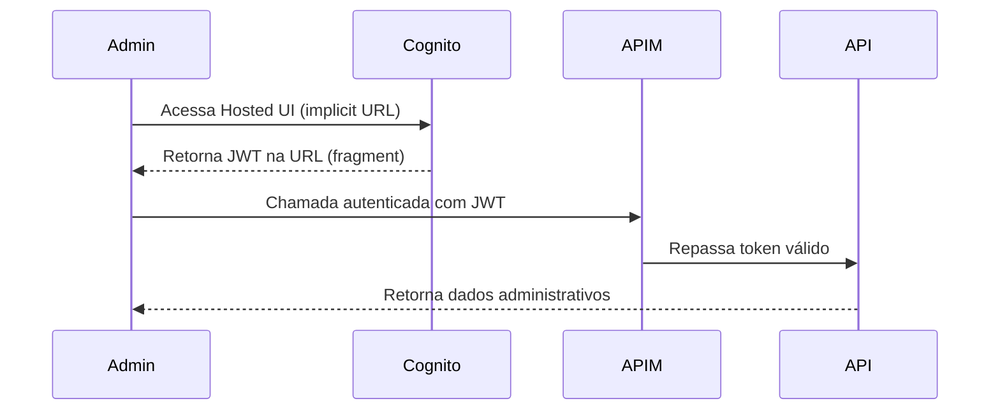
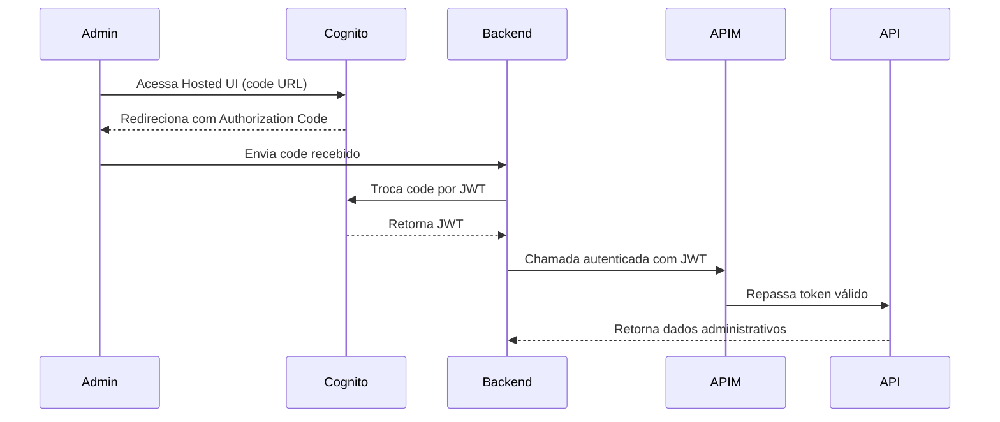

# 🔑​ Food Core Auth

API serveless para authenticação e permissão de usuários de restaurantes fast-food, desenvolvida como parte do curso de Arquitetura de Software
da FIAP (Tech Challenge).

<div align="center">
  <a href="#visao-geral">Visão Geral</a> •
  <a href="#tecnologias">Tecnologias</a> •
  <a href="#autenticacao-de-clientes">Autenticação de clientes</a> •
  <a href="#autenticacao-de-administradores">Autenticação de administradores</a> •
  <a href="#cicd-infra">Governança e Fluxo de Deploy</a>
</div><br>

# 🔑 Lambda de Autenticação - Identificação via CPF (C# + Cognito)

## 📖 Visão Geral

A Lambda é responsável pela **identificação de clientes** no sistema de autoatendimento.
Ela recebe o **CPF** do cliente, consulta o **Cognito**, gera um **JWT** e retorna o token para o **API Gateway (APIM)**, que repassa a chamada para a **FoodCore API**.

## 🚀 Tecnologias

- **C# .NET 9 AWS Lambda Runtime**
- **Azure APIM** (API Gateway)
- **AWS Cognito** (identificação/autenticação sem senha, apenas CPF ou Email)
- **JWT** para comunicação segura
- **GitHub Actions + Terraform** para deploy

## 🔄 Autenticação de clientes

1. O usuário informa **CPF ou EMAIL** no frontend.
2. A requisição chega no **APIM**, que redireciona para a **Azure Function (Lambda em C#)**.
3. O Cognito gera um **JWT**.
4. A **Azure Function** valida:
   - Assinatura do token via **JWKS público da AWS**
   - Se o usuário tem permissão de acessar o path solicitado (com base na Role)
   - O mecanismo é **implicit deny** (qualquer falha = acesso negado).
   - Se o token for válido, a Function retorna um body semelhante a esse:

    ```json
    {
      "subject": "a1b2c3d4-e5f6-7890-abcd-1234567890ef",
      "name": "João da Silva",
      "email": "joao.silva@example.com",
      "cpf": "12345678900",
      "role": "ADMIN",
      "createdAt": "2025-10-02T09:30:00Z"
    }
    ```

5. O **APIM** repassa a requisição com o **JWT** e todos os atributos retornados pela lambda em headers HTTP para a **FoodCore API**.

### Exemplo de Fluxo (cliente)



## 🧑‍💼 Autenticação de Administradores

Diferente dos clientes, administradores não autenticam via Lambda.
Eles utilizam diretamente a Hosted UI do AWS Cognito, onde realizam login com usuário e senha.

Os links da Hosted UI são expostos como outputs do Terraform e podem ser consultados no pipeline de CD (GitHub Actions) após o deploy.

### 🔗 Recuperando os links de autenticação

Nos outputs do Terraform, dois links são disponibilizados:

| **Hosted UI (Implicit Flow)**
 Realiza login e retorna o **JWT diretamente na URL** após a autenticação.

| **Hosted UI (Authorization Code Flow)**
Retorna um **código de autorização**, que deve ser trocado por um **JWT** via requisição de back-end.

### 🧭 Fluxos de Autenticação Cognito

🔸 Implicit Flow

Fluxo mais simples, retorna o token diretamente após o login.

Exemplo:



Exemplo de URL (output Terraform):

```bash
https://foodcore-auth-domain.auth.us-east-1.amazoncognito.com/login?
client_id=xxxxxxx&
response_type=token&
scope=email+openid+profile&
redirect_uri=https://foodcore.admin.app/login/callback
```

🔸 Authorization Code Flow

Fluxo mais seguro — retorna um código que o back-end troca por um JWT.
Esse método evita exposição do token diretamente na URL.

Exemplo:



Exemplo de URL (output Terraform):

```bash
https://foodcore-auth-domain.auth.us-east-1.amazoncognito.com/login?
client_id=xxxxxxx&
response_type=code&
scope=email+openid+profile&
redirect_uri=https://foodcore.admin.app/login/callback
```

✅ Resumo

| Tipo de Usuário   | Método de Login                           | Origem do JWT        | Meio de Validação                             |
| ----------------- | ----------------------------------------- | -------------------- | --------------------------------------------- |
| **Cliente**       | CPF/Email via Azure Function              | Cognito (via Lambda) | Azure Function valida assinatura e permissões |
| **Administrador** | Hosted UI Cognito (Implicit ou Code Flow) | Cognito Hosted UI    | APIM valida token via JWKS público da AWS     |

<h3 id="cicd-infra">🔐 Governança e Fluxo de Deploy de Infraestrutura</h3>

A gestão da infraestrutura segue um processo **automatizado, auditável e controlado** via **Pull Requests** no repositório de provisionamento.
Esse fluxo garante segurança, rastreabilidade e aprovação formal antes de qualquer mudança aplicada em produção.

---

### ⚙️ Processo de Alterações

1. **Criação de Pull Request**
   - Todas as alterações de infraestrutura (novos recursos, updates, ou ajustes de configuração) devem ser propostas via **Pull Request (PR)**.
   - O PR contém os arquivos `.tf` modificados e uma descrição detalhando o impacto da mudança.

2. **Execução Automática do Terraform Plan**
   - Ao abrir o PR, o pipeline de CI executa automaticamente o comando:

     ```
     terraform plan
     ```

   - Esse passo gera uma **prévia das alterações** que seriam aplicadas (criações, destruições, atualizações).
   - O resultado do `plan` é exibido diretamente nos logs do pipeline, permitindo revisão técnica pelos aprovadores.

3. **Revisão e Aprovação**
   - O repositório é **protegido**, exigindo no mínimo **2 aprovações** antes do merge.
   - Nenhum usuário pode aplicar alterações diretamente na branch principal (`main` ou `master`).
   - Revisores devem garantir:
     - Que o `plan` não tenha destruições indevidas (`destroy`)
     - Que as variáveis e roles estejam corretas
     - Que os módulos sigam o padrão organizacional

4. **Aplicação no Merge**
   - Após aprovação e merge do PR, o pipeline executa automaticamente:

     ```
     terraform apply -auto-approve
     ```

   - O **Terraform Apply** aplica as alterações descritas no `plan` aprovado, provisionando ou atualizando os recursos no Azure.

---
