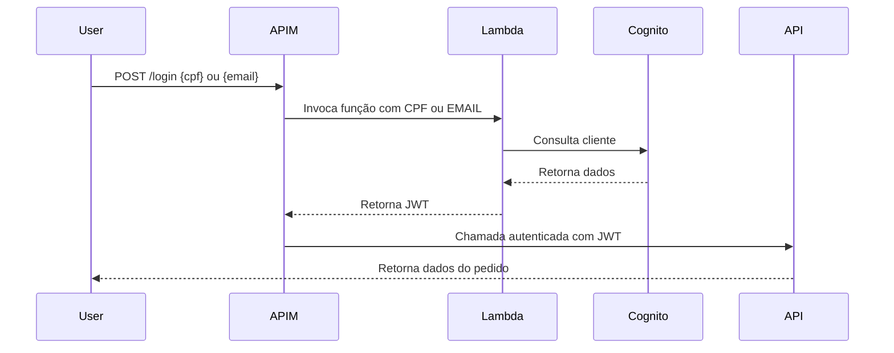
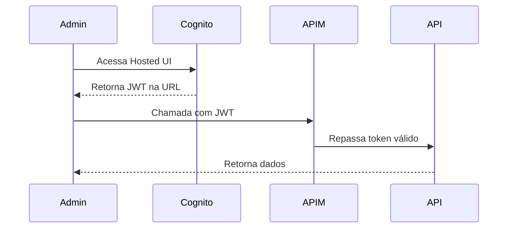

# � FoodCore Auth

<div align="center">

[](https://sonarcloud.io/summary/new_code?id=FIAP-SOAT-TECH-TEAM_foodcore-auth)
[](https://sonarcloud.io/summary/new_code?id=FIAP-SOAT-TECH-TEAM_foodcore-auth)
[](https://sonarcloud.io/summary/new_code?id=FIAP-SOAT-TECH-TEAM_foodcore-auth)
[](https://sonarcloud.io/summary/new_code?id=FIAP-SOAT-TECH-TEAM_foodcore-auth)

</div>

Azure Function serverless responsável pela autenticação e autorização de usuários do sistema FoodCore. Integrada com AWS Cognito para gerenciamento de identidade. Desenvolvida como parte do curso de Arquitetura de Software da FIAP (Tech Challenge).

<div align="center">
  <a href="#visao-geral">Visão Geral</a> •
  <a href="#arquitetura">Arquitetura</a> •
  <a href="#tecnologias">Tecnologias</a> •
  <a href="#fluxo-clientes">Autenticação de Clientes</a> •
  <a href="#fluxo-admin">Autenticação de Administradores</a> •
  <a href="#executando-testes">Executando os Testes</a> •
  <a href="#deploy">Governança e Fluxo de Deploy</a> •
  <a href="#contribuicao">Contribuição</a>
</div><br>

> 📽️ Vídeo de demonstração da arquitetura: [https://www.youtube.com/watch?v=XgUpOKJjqak](https://www.youtube.com/watch?v=XgUpOKJjqak)<br>

---

<h2 id="limitacoes-quota">Limitações de Quota (Azure for Students)</h2>

> A assinatura **Azure for Students** impõe as seguintes restrições:
>
> - **Região**: Brazil South não está disponível. Utilizamos **South Central US** como alternativa
>
> - **Quota de VMs**: Apenas **2 instâncias** do SKU utilizado para o node pool do AKS, tendo um impacto direto na escalabilidade do cluster. Quando o limite é atingido, novos nós não podem ser criados e dão erro no provisionamento de workloads.
>
> ### Erro no CD dos Microsserviços
>
> Durante o deploy dos microsserviços, Pods podem ficar com status **Pending** e o seguinte erro pode aparecer:
>
> 
>
> **Causa**: O cluster atingiu o limite máximo de VMs permitido pela quota e não há recursos computacionais (CPU/memória) disponíveis nos nós existentes.
>
> **Solução**: Aguardar a liberação de recursos de outros pods e reexecutar CI + CD.

<h2 id="visao-geral">📋 Visão Geral</h2>

O **FoodCore Auth** é uma Azure Function que implementa o padrão **Lambda Authorizer**, responsável pela identificação e autorização de usuários no sistema de autoatendimento.

### Fluxo Principal

1. Recebe **CPF** ou **Email** do cliente
2. Consulta o **AWS Cognito**
3. Gera e valida **JWT**
4. Retorna dados do usuário para o **APIM**
5. APIM repassa a requisição autenticada para os microsserviços

### Características

- **Serverless**: Executa sob demanda, sem servidor dedicado
- **Always On**: Configurado para minimizar cold start
- **Implicit Deny**: Qualquer falha de autenticação resulta em bloqueio
- **Caching**: Tokens cacheados no APIM para performance

---

<h2 id="arquitetura">🧱 Arquitetura</h2>

<details>
<summary>Expandir para mais detalhes</summary>

### 🎯 Padrão Lambda Authorizer

```
Cliente → APIM → Azure Function → Cognito
                      ↓
              Validação JWT (JWKS)
                      ↓
              Retorna claims
                      ↓
           APIM → Microsserviço
```

### 🔐 Validações Realizadas

- **Assinatura do token** via JWKS público da AWS
- **Permissão de acesso** ao path solicitado (baseada em Role)
- **Expiração do token**
- **Claims obrigatórias** (CPF, email, role)

### 📦 Estrutura do Projeto

```
function/
├── FoodcoreAuth/
│   ├── FoodcoreAuth.cs      # Endpoints da Function
│   ├── Program.cs           # Entry point
│   ├── Config/              # Configurações
│   ├── DTO/                 # Data Transfer Objects
│   ├── Exceptions/          # Exceções de domínio
│   ├── Helpers/             # Validação e autorização
│   ├── Mapper/              # Mapeamentos
│   ├── Model/               # Modelos de domínio
│   ├── Presenter/           # Formatação de respostas
│   ├── Services/            # Integração com Cognito
│   └── Utils/               # Utilitários
└── FoodcoreAuth.Tests/      # Testes unitários
```

### 🏗️ Microsserviços do Ecossistema

| Microsserviço | Responsabilidade | Repositório |
|---------------|------------------|-------------|
| **foodcore-auth** | Autenticação (este repositório) | [foodcore-auth](https://github.com/FIAP-SOAT-TECH-TEAM/foodcore-auth) |
| **foodcore-order** | Gerenciamento de pedidos | [foodcore-order](https://github.com/FIAP-SOAT-TECH-TEAM/foodcore-order) |
| **foodcore-payment** | Processamento de pagamentos | [foodcore-payment](https://github.com/FIAP-SOAT-TECH-TEAM/foodcore-payment) |
| **foodcore-catalog** | Catálogo de produtos | [foodcore-catalog](https://github.com/FIAP-SOAT-TECH-TEAM/foodcore-catalog) |

</details>

---

<h2 id="tecnologias">🔧 Tecnologias</h2>

| Categoria | Tecnologia |
|-----------|------------|
| **Runtime** | .NET 9 |
| **Cloud** | Azure Functions |
| **Identity** | AWS Cognito |
| **Gateway** | Azure APIM |
| **Testes** | xUnit, FluentAssertions |
| **Qualidade** | SonarCloud |
| **IaC** | Terraform |
| **CI/CD** | GitHub Actions |

---

<h2 id="fluxo-clientes">🔄 Autenticação de Clientes</h2>

<details>
<summary>Expandir para mais detalhes</summary>

Clientes autenticam via **CPF** ou **Email** através da Azure Function.

### Fluxo



### Resposta da Function

```json
{
  "subject": "a1b2c3d4-e5f6-7890-abcd-1234567890ef",
  "name": "João da Silva",
  "email": "joao.silva@example.com",
  "cpf": "12345678900",
  "role": "ADMIN",
  "createdAt": "2025-10-02T09:30:00Z"
}
```

</details>

---

<h2 id="fluxo-admin">🧑‍💼 Autenticação de Administradores</h2>

<details>
<summary>Expandir para mais detalhes</summary>

Administradores autenticam diretamente via **Hosted UI do Cognito** com usuário e senha.

### Fluxos Disponíveis

#### Implicit Flow
Retorna JWT diretamente na URL após login.



#### Authorization Code Flow
Retorna código que deve ser trocado por JWT via backend (mais seguro).

### Links da Hosted UI

Os links são expostos como outputs do Terraform após o deploy:
- **Implicit Flow URL**: Login com retorno direto do token
- **Authorization Code Flow URL**: Login com código de autorização

</details>

---

<h2 id="executando-testes">🧪 Executando os Testes</h2>

```bash
# Navegar para a pasta da solution
cd function

# Restaurar dependências
dotnet restore TC4.sln

# Executar todos os testes
dotnet test TC4.sln

# Executar com cobertura de código
dotnet test TC4.sln --collect:"XPlat Code Coverage"

# Executar com output detalhado
dotnet test TC4.sln --logger "console;verbosity=detailed"
```

---

<h2 id="deploy">⚙️ Fluxo de Deploy</h2>

<details>
<summary>Expandir para mais detalhes</summary>

### Pipeline CI/CD

1. **Pull Request**
   - Executa build e testes
   - Análise SonarCloud
   - Terraform Plan

2. **Merge para Main**
   - Terraform Apply
   - Deploy da Azure Function
   - Importação no APIM

### Recursos Provisionados

| Recurso | Descrição |
|---------|-----------|
| **Azure Function** | Função serverless de autenticação |
| **APIM Policy** | Política de autorização no API Gateway |
| **Cognito User Pool** | Pool de usuários no AWS |
| **Key Vault Secrets** | Credenciais do Cognito |

</details>

---

<h2 id="contribuicao">🤝 Contribuição</h2>

### Desenvolvimento Local

```bash
# Clonar repositório
git clone https://github.com/FIAP-SOAT-TECH-TEAM/foodcore-auth.git
cd foodcore-auth/function

# Configurar variáveis de ambiente
cp FoodcoreAuth/env-example FoodcoreAuth/.env

# Executar localmente
func start
```

### Licença

Este projeto está licenciado sob a [MIT License](LICENSE).

---

<div align="center">
  <strong>FIAP - Pós-graduação em Arquitetura de Software</strong><br>
  Tech Challenge
</div>
