# 🔒 FoodCore Auth

<div align="center">
    
[](https://sonarcloud.io/summary/new_code?id=FIAP-SOAT-TECH-TEAM_foodcore-auth)
[](https://sonarcloud.io/summary/new_code?id=FIAP-SOAT-TECH-TEAM_foodcore-auth)
[](https://sonarcloud.io/summary/new_code?id=FIAP-SOAT-TECH-TEAM_foodcore-auth)
[](https://sonarcloud.io/summary/new_code?id=FIAP-SOAT-TECH-TEAM_foodcore-auth)

</div>

Azure Function serverless responsável pela autenticação e autorização de usuários do sistema FoodCore. Integrada com AWS Cognito para gerenciamento de identidade. Desenvolvida como parte do curso de Arquitetura de Software da FIAP (Tech Challenge).

<div align="center">
  <a href="#visao-geral">Visão Geral</a> •
  <a href="#arquitetura">Arquitetura</a> •
  <a href="#tecnologias">Tecnologias</a> •
  <a href="#fluxo-clientes">Autenticação de Clientes</a> •
  <a href="#fluxo-admin">Autenticação de Administradores</a> •
  <a href="#executando-testes">Executando os Testes</a> •
  <a href="#deploy">Fluxo de Deploy</a> •
  <a href="#instalacao-e-uso">Instalação e Uso</a> •
  <a href="#contribuicao">Contribuição</a>
</div><br>

> 📽️ Vídeo de demonstração da arquitetura: [https://youtu.be/k3XbPRxmjCw](https://youtu.be/k3XbPRxmjCw)<br>

---

<h2 id="visao-geral">📋 Visão Geral</h2>

O **FoodCore Auth** é uma Azure Function que implementa o padrão **Lambda Authorizer**, responsável pela identificação e autorização de usuários no sistema de autoatendimento.

### Fluxo Principal

1. Recebe **CPF** ou **Email** do cliente
2. Consulta o **AWS Cognito**
3. Valida e interpreta **JWT (OAuth2 / OIDC)**
4. Retorna dados do usuário para o **APIM**
5. APIM repassa a requisição autenticada para os microsserviços

### Características

- **Serverless**: Executa sob demanda, sem servidor dedicado
- **Always On**: Configurado para minimizar cold start
- **OAuth 2.0 + OIDC**: Autorização padronizada e identidade federada
- **Implicit Deny**: Qualquer falha de autenticação resulta em bloqueio
- **Caching**: Tokens cacheados no APIM para performance

---

<h2 id="arquitetura">🧱 Arquitetura</h2>

<details>
<summary>Expandir para mais detalhes</summary>

### 🎯 OAuth 2.0 + OpenID Connect (OIDC)

O sistema utiliza:

- **OAuth 2.0** para **autorização** baseada em tokens
- **OpenID Connect (OIDC)** para **identidade**, fornecendo claims padronizadas do usuário

O **AWS Cognito** atua como **Identity Provider (IdP)**, emitindo **JWTs compatíveis com OIDC**, enquanto a Azure Function valida e aplica regras de autorização.

### 🎯 Padrão Lambda Authorizer

```
Cliente → APIM → Azure Function → Cognito
                      ↓
              Validação JWT (JWKS)
                      ↓
              Retorna claims
                      ↓
           APIM → Microsserviço
```

### 🔑 Tokens e Claims

- **Access Token (JWT)**: Utilizado para autorização
- **ID Token (OIDC)**: Contém identidade do usuário
- **Claims validadas**:
  - `sub` (subject)
  - `email`
  - `cpf`
  - `role`
  - `exp` (expiração)

### 🔐 Validações Realizadas

- **Assinatura do token** via JWKS público da AWS
- **Conformidade com **OAuth 2.0 / OIDC**
- **Permissão de acesso** ao path solicitado baseada em Role (RBAC)
- **Expiração do token**
- **Claims obrigatórias** (CPF, email, role)

### 📦 Estrutura do Projeto

```
function/
├── FoodcoreAuth/
│   ├── FoodcoreAuth.cs      # Endpoints da Function
│   ├── Program.cs           # Entry point
│   ├── Config/              # Configurações
│   ├── DTO/                 # Data Transfer Objects
│   ├── Exceptions/          # Exceções de domínio
│   ├── Helpers/             # Validação e autorização
│   ├── Mapper/              # Mapeamentos
│   ├── Model/               # Modelos de domínio
│   ├── Presenter/           # Formatação de respostas
│   ├── Services/            # Integração com Cognito
│   └── Utils/               # Utilitários
└── FoodcoreAuth.Tests/      # Testes unitários
```

### 🏗️ Microsserviços do Ecossistema

| Microsserviço | Responsabilidade | Repositório |
|---------------|------------------|-------------|
| **foodcore-auth** | Autenticação (este repositório) | [foodcore-auth](https://github.com/FIAP-SOAT-TECH-TEAM/foodcore-auth) |
| **foodcore-order** | Gerenciamento de pedidos | [foodcore-order](https://github.com/FIAP-SOAT-TECH-TEAM/foodcore-order) |
| **foodcore-payment** | Processamento de pagamentos | [foodcore-payment](https://github.com/FIAP-SOAT-TECH-TEAM/foodcore-payment) |
| **foodcore-catalog** | Catálogo de produtos | [foodcore-catalog](https://github.com/FIAP-SOAT-TECH-TEAM/foodcore-catalog) |

</details>

---

<h2 id="tecnologias">🔧 Tecnologias</h2>

| Categoria | Tecnologia |
|-----------|------------|
| **Runtime** | .NET 9 |
| **Cloud** | Azure Functions |
| **Identity** | AWS Cognito |
| **Gateway** | Azure APIM |
| **Testes** | xUnit, FluentAssertions |
| **Qualidade** | SonarCloud |
| **IaC** | Terraform |
| **CI/CD** | GitHub Actions |

---

<h2 id="fluxo-clientes">🔄 Autenticação de Clientes</h2>

<details>
<summary>Expandir para mais detalhes</summary>

Clientes autenticam via **CPF** ou **Email** através da Azure Function.

### Fluxo

```mermaid
sequenceDiagram
    participant User
    participant APIM
    participant Lambda
    participant Cognito
    participant API

    User->>APIM: POST /login {cpf} ou {email}
    APIM->>Lambda: Invoca função com CPF ou EMAIL
    Lambda->>Cognito: Consulta cliente
    Cognito-->>Lambda: Retorna dados
    Lambda-->>APIM: Retorna JWT
    APIM->>API: Chamada autenticada com JWT
    API-->>User: Retorna dados do pedido
```



### Resposta da Function

```json
{
  "subject": "a1b2c3d4-e5f6-7890-abcd-1234567890ef",
  "name": "João da Silva",
  "email": "joao.silva@example.com",
  "cpf": "12345678900",
  "role": "ADMIN",
  "createdAt": "2025-10-02T09:30:00Z"
}
```

</details>

---

<h2 id="fluxo-admin">🧑‍💼 Autenticação de Administradores</h2>

<details>
<summary>Expandir para mais detalhes</summary>

Administradores autenticam diretamente via **Hosted UI do Cognito** com usuário e senha.

### Fluxos Disponíveis

#### Implicit Flow

Retorna JWT diretamente na URL após login.

```mermaid
sequenceDiagram
    participant Admin
    participant Cognito
    participant APIM
    participant API

    Admin->>Cognito: Acessa Hosted UI
    Cognito-->>Admin: Retorna JWT na URL
    Admin->>APIM: Chamada com JWT
    APIM->>API: Repassa token válido
    API-->>Admin: Retorna dados
```



#### Authorization Code Flow

Retorna código que deve ser trocado por JWT via backend (mais seguro).

### Links da Hosted UI

Os links são expostos como outputs do Terraform após o deploy:

- **Implicit Flow URL**: Login com retorno direto do token
- **Authorization Code Flow URL**: Login com código de autorização

</details>

---

<h2 id="executando-testes">🧪 Executando os Testes</h2>

```bash
# Navegar para a pasta da solution
cd function

# Restaurar dependências
dotnet restore TC4.sln

# Executar todos os testes
dotnet test TC4.sln

# Executar com cobertura de código
dotnet test TC4.sln --collect:"XPlat Code Coverage"

# Executar com output detalhado
dotnet test TC4.sln --logger "console;verbosity=detailed"
```

---

<h2 id="deploy">⚙️ Fluxo de Deploy</h2>

<details>
<summary>Expandir para mais detalhes</summary>

### Pipeline

1. **Pull Request**
   - Preencher template de pull request adequadamente

2. **Revisão e Aprovação**
   - Mínimo 1 aprovação de CODEOWNER

3. **Merge para Main**

### Proteções

- Branch `main` protegida
- Nenhum push direto permitido
- Todos os checks devem passar

### Ordem de Provisionamento

```
1. foodcore-infra        (AKS, VNET)
2. foodcore-db           (Bancos de dados)
3. foodcore-auth           (Azure Function Authorizer)
4. foodcore-observability (Serviços de Observabilidade)
5. foodcore-order            (Microsserviço de pedido)
6. foodcore-payment            (Microsserviço de pagamento)
7. foodcore-catalog            (Microsserviço de catálogo)
```

> ⚠️ Opcionalmente, as pipelines do repositório `foodcore-shared` podem ser executadas para publicação de um novo package. Atualizar os microsserviços para utilazarem a nova versão do pacote.

</details>

---

<h2 id="instalacao-e-uso">🚀 Instalação e Uso</h2>

### Desenvolvimento Local

```bash
# Clonar repositório
git clone https://github.com/FIAP-SOAT-TECH-TEAM/foodcore-auth.git
cd foodcore-auth/function

# Configurar variáveis de ambiente
cp FoodcoreAuth/env-example FoodcoreAuth/.env

# Executar localmente
func start
```

---

<h2 id="contribuicao">🤝 Contribuição</h2>

### Fluxo de Contribuição

1. Crie uma branch a partir de `main`
2. Implemente suas alterações
3. Execute os testes: `dotnet test TC4.sln`
4. Abra um Pull Request
5. Aguarde aprovação de um CODEOWNER

### Licença

Este projeto está licenciado sob a [MIT License](LICENSE).

---

<div align="center">
  <strong>FIAP - Pós-graduação em Arquitetura de Software</strong><br>
  Tech Challenge 4
</div>
